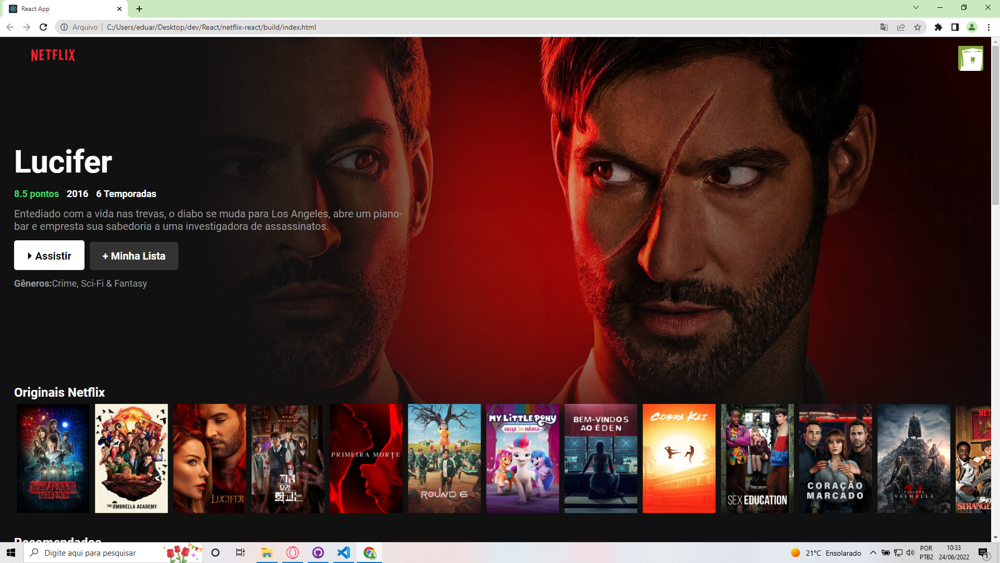

# Clone Netflix React

 &nbsp
<i>Dedico esse projeto à minha filhota Arya e minha esposa Sara!</i>   

## 💻 Sobre

Desenvolvido por <b>Eduardo Dias</b>, o projeto é um clone da plataforma Netflix desenvolvido em React utilizando Typescript e CSS puro.   

## 🛠 Tecnologias

  

## ⚙ Status:

:heavy_check_mark: API Request;
 
:heavy_check_mark: Montagem da interface;
  
:heavy_check_mark: Efeitos hover;

:heavy_check_mark: Componetização valendo-se das melhores práticas;

:heavy_check_mark: Loading enquanto os filmes não forem carregados;

:hammer: Informações do filme ao clicar no banner;

 

##  🍿 Demo da Aplicação:

   &nbsp;&nbsp;  <a align="center" href="https://netflix-clone-seven-lake.vercel.app"><i><b>ACESSE A APLICAÇÃO AQUI</a> &nbsp;&nbsp;</b></i>

  

  
